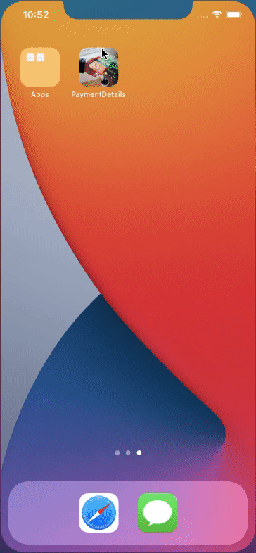
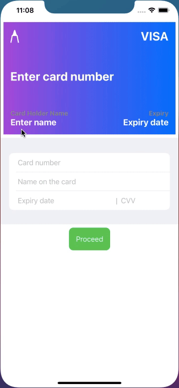
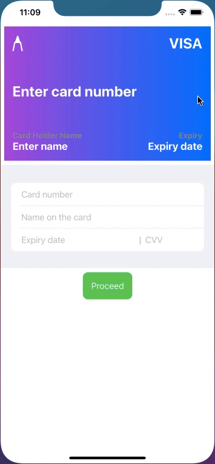
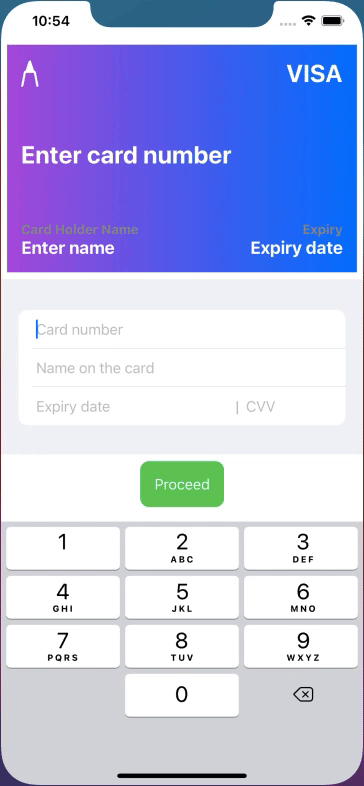
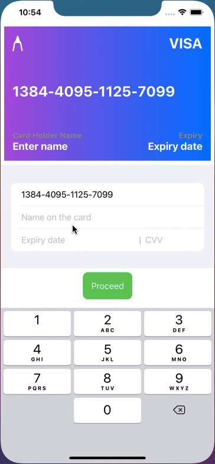
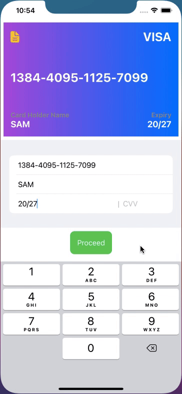
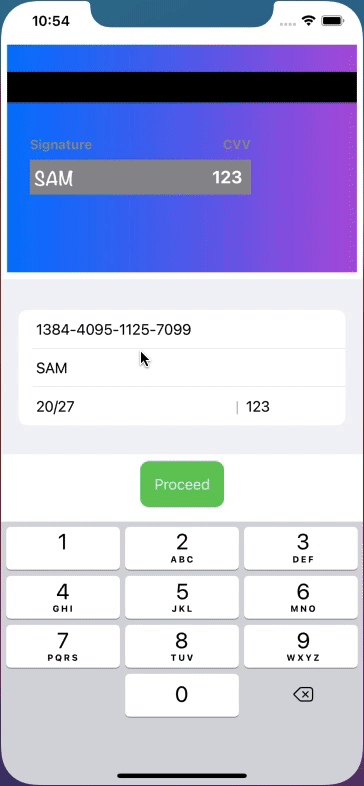

# PaymentDetailsCollection
This app view helps to collect card details of the user using card beautiful layout and animations.

## App launch

## Multiple card animations

   

## Entering card details 
- Realtime text updation on card while filling details
- Automatically adds "-" or "/" while entering details 

## Rotates card while filling CVV 

  

## Button to process the payment
- Alerts before confirming the payment

